# GD and Signatrain User Journeys v1.0

These Mermaid diagrams are the canonical, Miro-ready journey sources. Each diagram is stored separately in `mmd/`; the matching `svg/` file is a static preview generated from the same structured journey definition.

## Journey catalog

| ID | Journey | Domain | Primary actors | Key integrations |
|---|---|---|---|---|
| J00 | Integrated Journey Landscape | Cross-platform | All external and internal roles | Shared Core, Signatrain, GD Portal, Legislative Tracking |
| J01 | Invitation, Account Activation, and Cross-Product Access | Shared Platform Core | Inviting administrator; invited user; platform | Authentication provider; email provider |
| J02 | Company Setup and Manual Seat Provisioning | Shared Platform Core | Internal domain administrator; Company Owner; Company HR Admin; platform | Email provider; optional contract/CRM references |
| J03 | Online Company Purchase and Entitlement Activation | Shared Platform Core / Optional Billing | Company Owner; platform; Stripe; internal operations | Stripe; email provider |
| J04 | Cancellation, Organization Archive, and Reactivation | Shared Platform Core | Company Owner; internal administrator; platform; Stripe | Stripe for online subscriptions |
| J05 | Signatrain HR Subscriber Learning Journey | Signatrain HR | HR Subscriber; Signatrain portal; video provider; optional Bot and Legislative Tracking services | Secure video provider; Zoom; third-party Bot; Legislative Tracking |
| J06 | Manager Program Enrollment and Completion | Signatrain Manager | Manager Subscriber; Company HR Admin; Signatrain portal; Zoom; video provider | Secure video provider; Zoom; certificate service |
| J07 | Private Company Cohort Lifecycle | Signatrain Cohorts | Signatrain Ops / Content Admin; Company HR Admin; cohort learner; faculty | Zoom; secure video/file storage; notifications |
| J08 | Live Session Registration, Attendance, and Recording Lifecycle | Signatrain Live Sessions | Signatrain administrator; learner; faculty; platform; Zoom | Zoom; email/in-app notifications; secure video provider |
| J09 | Signatrain Content Authoring, Review, and Publication | Signatrain Content Administration | Signatrain Ops / Content Admin; Faculty / Content Reviewer; platform | Secure video provider; file storage; notifications |
| J10 | Certificate Eligibility, Issuance, and Verification | Signatrain Completion and Certificates | Learner; platform; Signatrain administrator; public verifier | Certificate file storage; email provider |
| J11 | Greenwald Doherty Client Onboarding | GD Portal | GD Operations Admin; Company Owner / GD Client User; platform | File storage; email provider; optional Centerbase and Stripe references |
| J12 | GD Legal Request, Triage, and Matter Conversion | GD Portal | GD Client User; GD Operations Admin; assigned GD Attorney; Centerbase | File storage; Calendly; Centerbase; email notifications |
| J13 | GD Flat-Fee Project Request and Adobe Sign Handoff | GD Portal | GD client; GD Operations Admin; GD Attorney; Adobe Sign; Centerbase | Adobe Sign; Centerbase; email notifications |
| J14 | GD-Included Signatrain HR Seat Provisioning | Cross-product GD to Signatrain | GD Operations Admin; Company Owner / Company HR Admin; platform; invited HR user | Shared entitlement layer; email provider |
| J15 | Legislative Alert Authoring, Legal Review, and Distribution | Legislative Tracking MVP-Lite | Alert editor; GD Attorney / legal reviewer; operations publisher; eligible recipient; platform | Email provider; GD and Signatrain portal contexts |
| J16 | Legislative Tracking Jurisdiction Coverage Change | Legislative Tracking MVP-Lite | Company Owner / Company HR Admin; internal operations; platform | Notifications; optional commercial / contract reference |

## Detailed diagrams

### J00 - Integrated Journey Landscape

**Domain:** Cross-platform  
**Primary actors:** All external and internal roles  
**Trigger:** Product discovery and platform planning  
**Outcome:** Traceable index of detailed journeys  
**Integrations:** Shared Core, Signatrain, GD Portal, Legislative Tracking  
**Traceability:** Product Definition v1.0; Functional Map v1.0

**Scope notes:** This diagram is an index. Detailed behavior is defined in J01-J16.

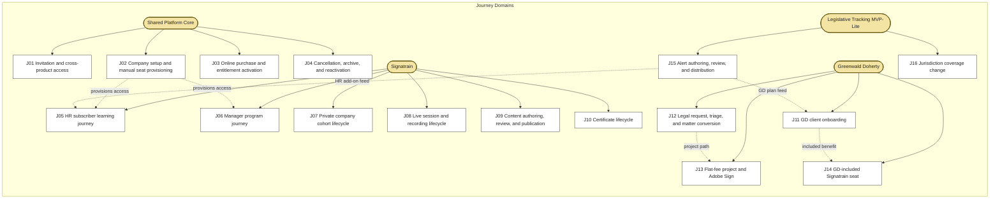

### J01 - Invitation, Account Activation, and Cross-Product Access

**Domain:** Shared Platform Core  
**Primary actors:** Inviting administrator; invited user; platform  
**Trigger:** Administrator invites a user and assigns permitted product access  
**Outcome:** Active account with role- and entitlement-based access to GD, Signatrain, or both  
**Integrations:** Authentication provider; email provider  
**Traceability:** CORE-IAM-01/02/08; CORE-USR-02/03; CORE-ENT-05; CORE-NOT-02

**Scope notes:** Permissions are additive when a user holds multiple roles. Company 3 is never shown as a user-facing product.

```mermaid
%% J01 - Invitation, Account Activation, and Cross-Product Access
%% Domain: Shared Platform Core
%% Source requirements: CORE-IAM-01/02/08; CORE-USR-02/03; CORE-ENT-05; CORE-NOT-02
flowchart LR
  subgraph ADMIN["Inviting Administrator"]
    direction TB
    A1(["Select organization, user email, roles, and products"])
    A2["Confirm seat or entitlement availability"]
    A3["Resend or revoke invitation"]
  end
  subgraph PLAT["Shared Platform"]
    direction TB
    P1["Validate organization scope and administrator authority"]
    P2["Reserve seat and create pending invitation"]
    P3[["Send time-limited invitation email"]]
    D1{"Invitation valid?"}
    P4["Activate account and assigned roles"]
    P5["Evaluate active entitlements and product permissions"]
    D2{"Access to both public products?"}
  end
  subgraph USER["Invited User"]
    direction TB
    U1["Open invitation link"]
    U2["Set credentials and accept required terms"]
    U3["Sign in"]
    U4["Open My Products switcher"]
    U5["Enter entitled portal directly"]
    END(["User reaches authorized dashboard"])
  end
  A1 --> A2
  A2 --> P1
  P1 --> P2
  P2 --> P3
  P3 --> U1
  U1 --> D1
  D1 -->|"Yes"| U2
  D1 -->|"No / expired"| A3
  A3 -->|"Resend"| P3
  U2 --> P4
  P4 --> U3
  U3 --> P5
  P5 --> D2
  D2 -->|"Yes"| U4
  D2 -->|"No"| U5
  U4 -->|"Select GD or Signatrain"| END
  U5 --> END
  classDef action fill:#FFFFFF,stroke:#3A3A3A,stroke-width:1px,color:#222222;
  classDef startend fill:#F4E4A3,stroke:#5A4A00,stroke-width:1.5px,color:#222222;
  classDef decision fill:#FFF4CC,stroke:#7A6500,stroke-width:1.5px,color:#222222;
  classDef integration fill:#EEF3F8,stroke:#3A5872,stroke-width:1px,color:#222222;
  classDef note fill:#F3F3F3,stroke:#777777,stroke-dasharray: 4 3,color:#333333;
  class A1,END startend;
  class A2,P1,P2,U1,U2,P4,U3,P5,U4,U5,A3 action;
  class P3 integration;
  class D1,D2 decision;
```

### J02 - Company Setup and Manual Seat Provisioning

**Domain:** Shared Platform Core  
**Primary actors:** Internal domain administrator; Company Owner; Company HR Admin; platform  
**Trigger:** A contract or approved commercial relationship requires manual provisioning  
**Outcome:** Active organization, administrators, seat inventory, assigned users, and product entitlements  
**Integrations:** Email provider; optional contract/CRM references  
**Traceability:** CORE-ORG-01/05; CORE-USR-02/04; CORE-ENT-02/03/04/05/06; CORE-AUD-01

**Scope notes:** Manual provisioning is the default launch model. Historical learning and legal records remain with the archived user after a seat transfer.

```mermaid
%% J02 - Company Setup and Manual Seat Provisioning
%% Domain: Shared Platform Core
%% Source requirements: CORE-ORG-01/05; CORE-USR-02/04; CORE-ENT-02/03/04/05/06; CORE-AUD-01
flowchart LR
  subgraph INT["Internal Administrator"]
    direction TB
    I1(["Create customer organization"])
    I2["Set company profile, status, plan references, and jurisdictions"]
    I3["Assign Company Owner and optional Company HR Admin"]
    I4["Grant product entitlement with source and effective dates"]
    I5["Create purchased or included seat inventory"]
  end
  subgraph PLAT["Shared Platform"]
    direction TB
    P1["Record audit events and available seat counts"]
    P2[["Reserve seats and send invitations"]]
    D1{"Seat available and user eligible?"}
    P3["Activate user entitlement"]
    END(["Users can access assigned products"])
  end
  subgraph COMP["Company Administrator"]
    direction TB
    C1["Open company user and seat administration"]
    C2["Invite eligible users"]
    C3["Assign available HR or Manager seats"]
    C4["Archive departing user"]
    C5["Transfer seat to another eligible user"]
  end
  I1 --> I2
  I2 --> I3
  I3 --> I4
  I4 --> I5
  I5 --> P1
  P1 --> C1
  C1 --> C2
  C2 --> P2
  P2 --> C3
  C3 --> D1
  D1 -->|"Yes"| P3
  P3 --> END
  D1 -->|"No - correct inventory or assignment"| C3
  END -.->|"Employee leaves"| C4
  C4 --> C5
  C5 --> D1
  classDef action fill:#FFFFFF,stroke:#3A3A3A,stroke-width:1px,color:#222222;
  classDef startend fill:#F4E4A3,stroke:#5A4A00,stroke-width:1.5px,color:#222222;
  classDef decision fill:#FFF4CC,stroke:#7A6500,stroke-width:1.5px,color:#222222;
  classDef integration fill:#EEF3F8,stroke:#3A5872,stroke-width:1px,color:#222222;
  classDef note fill:#F3F3F3,stroke:#777777,stroke-dasharray: 4 3,color:#333333;
  class I1,END startend;
  class I2,I3,I4,I5,P1,C1,C2,C3,P3,C4,C5 action;
  class P2 integration;
  class D1 decision;
```

### J03 - Online Company Purchase and Entitlement Activation

**Domain:** Shared Platform Core / Optional Billing  
**Primary actors:** Company Owner; platform; Stripe; internal operations  
**Trigger:** Company Owner chooses an eligible subscription or additional seats  
**Outcome:** Paid or approved subscription creates active entitlements and seat inventory  
**Integrations:** Stripe; email provider  
**Traceability:** CORE-BILL-01-08/10/11; CORE-ENT-03/04/05; CORE-NOT-02

**Scope notes:** Stripe is authoritative for self-service payment state. The portal stores references and status, never raw card or bank details.

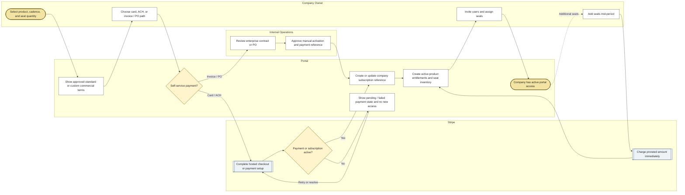

### J04 - Cancellation, Organization Archive, and Reactivation

**Domain:** Shared Platform Core  
**Primary actors:** Company Owner; internal administrator; platform; Stripe  
**Trigger:** Cancellation, contract expiry, suspension, or later reactivation  
**Outcome:** Access ends at the correct time without deleting historical records, and may later be restored  
**Integrations:** Stripe for online subscriptions  
**Traceability:** CORE-BILL-08/11; CORE-ORG-04; CORE-USR-04; CORE-ENT-07; PD cancellation rules

**Scope notes:** Cancellation stops renewal but does not revoke access before the paid period ends. Archived records are retained according to domain-specific retention rules.

```mermaid
%% J04 - Cancellation, Organization Archive, and Reactivation
%% Domain: Shared Platform Core
%% Source requirements: CORE-BILL-08/11; CORE-ORG-04; CORE-USR-04; CORE-ENT-07; PD cancellation rules
flowchart LR
  subgraph ACTOR["Company Owner / Internal Admin"]
    direction TB
    A1(["Request cancellation or record contract end"])
    A2["Approve new contract, payment, or manual reactivation"]
  end
  subgraph PLAT["Shared Platform"]
    direction TB
    P1["Set cancellation at paid-period end"]
    P2["Keep access active through paid period"]
    D1{"Paid period ended?"}
    P3["Expire or revoke affected entitlements"]
    P4["Archive company access and external users"]
    P5["Retain learning, certificate, request, audit, and reference history"]
    END1(["Organization archived; no grace period"])
    P6["Reactivate organization and selected users"]
    P7["Grant new active entitlements and seat inventory"]
    END2(["Authorized access restored"])
  end
  subgraph PAY["Stripe / Contract Source"]
    direction TB
    S1[["Stop renewal and retain period-end date"]]
  end
  A1 --> P1
  P1 --> S1
  S1 --> P2
  P2 --> D1
  D1 -->|"No"| P2
  D1 -->|"Yes"| P3
  P3 --> P4
  P4 --> P5
  P5 --> END1
  END1 -.->|"Later reactivation"| A2
  A2 --> P6
  P6 --> P7
  P7 --> END2
  classDef action fill:#FFFFFF,stroke:#3A3A3A,stroke-width:1px,color:#222222;
  classDef startend fill:#F4E4A3,stroke:#5A4A00,stroke-width:1.5px,color:#222222;
  classDef decision fill:#FFF4CC,stroke:#7A6500,stroke-width:1.5px,color:#222222;
  classDef integration fill:#EEF3F8,stroke:#3A5872,stroke-width:1px,color:#222222;
  classDef note fill:#F3F3F3,stroke:#777777,stroke-dasharray: 4 3,color:#333333;
  class A1,END1,END2 startend;
  class P1,P2,P3,P4,P5,A2,P6,P7 action;
  class S1 integration;
  class D1 decision;
```

### J05 - Signatrain HR Subscriber Learning Journey

**Domain:** Signatrain HR  
**Primary actors:** HR Subscriber; Signatrain portal; video provider; optional Bot and Legislative Tracking services  
**Trigger:** HR subscriber enters Signatrain with active HR entitlement  
**Outcome:** Subscriber consumes entitled learning, attends live sessions, and completes eligible courses  
**Integrations:** Secure video provider; Zoom; third-party Bot; Legislative Tracking  
**Traceability:** ST-ACC-01; ST-LIB-01-04; ST-CRS-01/03-08; ST-VID-01-04; ST-BOT-01/02; ST-CERT

**Scope notes:** Manager-only users cannot access HR Masterclasses, Risk Roundtable, Bot, or Legislative Tracking. Transcript full-text search is outside MVP.

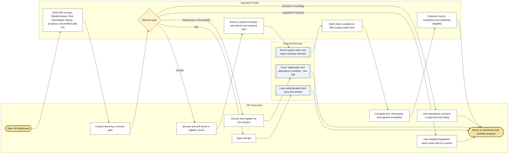

### J06 - Manager Program Enrollment and Completion

**Domain:** Signatrain Manager  
**Primary actors:** Manager Subscriber; Company HR Admin; Signatrain portal; Zoom; video provider  
**Trigger:** Manager receives active Manager entitlement and a program assignment or self-enrolls  
**Outcome:** All configured required courses and core sessions are completed and reported  
**Integrations:** Secure video provider; Zoom; certificate service  
**Traceability:** ST-ACC-02; ST-CRS-02/03-10; ST-VID-01-05; ST-LIVE-02-08; ST-CERT; ST-COMP-02/04

**Scope notes:** The required courses and sessions are configurable; they are not hard-coded. Manager subscribers do not gain access to HR-only features.

```mermaid
%% J06 - Manager Program Enrollment and Completion
%% Domain: Signatrain Manager
%% Source requirements: ST-ACC-02; ST-CRS-02/03-10; ST-VID-01-05; ST-LIVE-02-08; ST-CERT; ST-COMP-02/04
flowchart LR
  subgraph ADMIN["Company HR Admin"]
    direction TB
    A1(["Assign manager to configured program"])
    A2["Review progress and export company CSV"]
  end
  subgraph MGR["Manager Subscriber"]
    direction TB
    M1["Open Manager dashboard"]
    M2["Complete ordered course modules"]
    M3["Register for and attend required live sessions"]
  end
  subgraph PORTAL["Signatrain Portal"]
    direction TB
    P1["Validate active seat and create enrollment"]
    P2["Show required courses, scenarios, and three core sessions"]
    P3["Require 95% unique video completion"]
    P4["Require at least 90% session attendance"]
    D1{"All configured program requirements complete?"}
    P5["Show remaining required items"]
    P6["Mark Manager program complete"]
    P7["Evaluate and issue certificate when configured"]
    END(["Program completion recorded and reportable"])
  end
  subgraph EXT["Video / Zoom"]
    direction TB
    E1[["Track secure video watch intervals"]]
    E2[["Return aggregated Zoom attendance"]]
  end
  A1 --> P1
  P1 --> M1
  M1 --> P2
  P2 --> M2
  M2 --> E1
  E1 --> P3
  P3 --> M3
  M3 --> E2
  E2 --> P4
  P4 --> D1
  D1 -->|"No"| P5
  P5 -->|"Complete remaining learning"| M2
  D1 -->|"Yes"| P6
  P6 --> P7
  P7 --> A2
  A2 --> END
  classDef action fill:#FFFFFF,stroke:#3A3A3A,stroke-width:1px,color:#222222;
  classDef startend fill:#F4E4A3,stroke:#5A4A00,stroke-width:1.5px,color:#222222;
  classDef decision fill:#FFF4CC,stroke:#7A6500,stroke-width:1.5px,color:#222222;
  classDef integration fill:#EEF3F8,stroke:#3A5872,stroke-width:1px,color:#222222;
  classDef note fill:#F3F3F3,stroke:#777777,stroke-dasharray: 4 3,color:#333333;
  class A1,END startend;
  class P1,M1,P2,M2,P3,M3,P4,P5,P6,P7,A2 action;
  class E1,E2 integration;
  class D1 decision;
```

### J07 - Private Company Cohort Lifecycle

**Domain:** Signatrain Cohorts  
**Primary actors:** Signatrain Ops / Content Admin; Company HR Admin; cohort learner; faculty  
**Trigger:** A private cohort is contracted for one organization  
**Outcome:** Company-only roster completes assigned sessions and private materials with scoped reporting  
**Integrations:** Zoom; secure video/file storage; notifications  
**Traceability:** ST-COH-01/03-06; ST-LIVE-03-10; ST-COMP-02/04; ST-CMS-10

**Scope notes:** Company-specific materials and scenarios are supported. White-label company branding is deferred; standard Signatrain branding applies.

```mermaid
%% J07 - Private Company Cohort Lifecycle
%% Domain: Signatrain Cohorts
%% Source requirements: ST-COH-01/03-06; ST-LIVE-03-10; ST-COMP-02/04; ST-CMS-10
flowchart LR
  subgraph OPS["Signatrain Operations"]
    direction TB
    O1(["Create private cohort for one organization"])
    O2["Set dates, faculty, program rules, and company-only access"]
    O3["Assign live sessions and private scenarios / materials"]
    O4["Review roster, no-shows, completion, and overrides"]
  end
  subgraph COMP["Company HR Admin"]
    direction TB
    C1["Select eligible company users"]
    C2["View company-scoped progress and export CSV"]
  end
  subgraph LEARN["Cohort Learner"]
    direction TB
    L1["Open cohort workspace"]
    L2["Access private materials and scenarios"]
    L3["Register for assigned cohort sessions"]
    L4["Attend sessions and complete assigned content"]
  end
  subgraph PORTAL["Platform / Zoom"]
    direction TB
    D1{"User belongs to cohort company and has required access?"}
    P1["Add learner to cohort roster and send notification"]
    P2[["Create Zoom registrations and provide join links"]]
    P3["Calculate attendance and program completion"]
    END(["Cohort completed with organization-scoped records"])
  end
  O1 --> O2
  O2 --> O3
  O3 --> C1
  C1 --> D1
  D1 -->|"Yes"| P1
  D1 -->|"No - choose eligible user"| C1
  P1 --> L1
  L1 --> L2
  L2 --> L3
  L3 --> P2
  P2 --> L4
  L4 --> P3
  P3 --> O4
  O4 --> C2
  C2 --> END
  classDef action fill:#FFFFFF,stroke:#3A3A3A,stroke-width:1px,color:#222222;
  classDef startend fill:#F4E4A3,stroke:#5A4A00,stroke-width:1.5px,color:#222222;
  classDef decision fill:#FFF4CC,stroke:#7A6500,stroke-width:1.5px,color:#222222;
  classDef integration fill:#EEF3F8,stroke:#3A5872,stroke-width:1px,color:#222222;
  classDef note fill:#F3F3F3,stroke:#777777,stroke-dasharray: 4 3,color:#333333;
  class O1,END startend;
  class O2,O3,C1,P1,L1,L2,L3,L4,P3,O4,C2 action;
  class D1 decision;
  class P2 integration;
```

### J08 - Live Session Registration, Attendance, and Recording Lifecycle

**Domain:** Signatrain Live Sessions  
**Primary actors:** Signatrain administrator; learner; faculty; platform; Zoom  
**Trigger:** A Masterclass, Risk Roundtable, course session, or cohort session is scheduled  
**Outcome:** Eligible users register, attendance is calculated, and approved recordings may enter the library  
**Integrations:** Zoom; email/in-app notifications; secure video provider  
**Traceability:** ST-LIVE-01-11; ST-VID-07; Zoom integration map

**Scope notes:** Opening a join link does not count as completion. Recordings are never auto-published.

```mermaid
%% J08 - Live Session Registration, Attendance, and Recording Lifecycle
%% Domain: Signatrain Live Sessions
%% Source requirements: ST-LIVE-01-11; ST-VID-07; Zoom integration map
flowchart LR
  subgraph OPS["Signatrain Operations"]
    direction TB
    O1(["Create session with date, audience, faculty, and status"])
    D1{"Session rescheduled or cancelled?"}
    O2["Optionally apply audited attendance override"]
    O3["Review and approve recording"]
    D3{"Approved for publication?"}
  end
  subgraph USER["Learner / Faculty"]
    direction TB
    U1["Browse eligible dates and register"]
    U2["Open authorized join link near start time"]
  end
  subgraph PORTAL["Signatrain Portal"]
    direction TB
    P1["Create or link Zoom meeting / webinar"]
    P2["Validate entitlement and create portal registration"]
    P3["Update registrations and notify affected users"]
    P4["Aggregate all attendance intervals"]
    D2{"Attendance at least 90%?"}
    P5["Mark session completed"]
    P6["Mark attended / no-show but not completed"]
    P7["Publish recording to entitled library"]
    END(["Attendance and recording status finalized"])
  end
  subgraph ZOOM["Zoom / Video Provider"]
    direction TB
    Z1[["Create Zoom registrant and return join reference"]]
    Z2[["Capture join and leave intervals"]]
    Z3[["Produce recording reference"]]
    Z4[["Transfer / associate secure video asset"]]
  end
  O1 --> P1
  P1 --> U1
  U1 --> P2
  P2 --> Z1
  Z1 --> D1
  D1 -->|"Yes"| P3
  P3 -->|"Reselect date when applicable"| U1
  D1 -->|"No"| U2
  U2 --> Z2
  Z2 --> P4
  P4 --> D2
  D2 -->|"Yes"| P5
  D2 -->|"No"| P6
  P6 -.->|"Correction needed"| O2
  O2 -->|"Override complete"| P5
  P5 --> Z3
  P6 --> Z3
  Z3 --> O3
  O3 --> D3
  D3 -->|"Yes"| Z4
  Z4 --> P7
  D3 -->|"No"| END
  P7 --> END
  classDef action fill:#FFFFFF,stroke:#3A3A3A,stroke-width:1px,color:#222222;
  classDef startend fill:#F4E4A3,stroke:#5A4A00,stroke-width:1.5px,color:#222222;
  classDef decision fill:#FFF4CC,stroke:#7A6500,stroke-width:1.5px,color:#222222;
  classDef integration fill:#EEF3F8,stroke:#3A5872,stroke-width:1px,color:#222222;
  classDef note fill:#F3F3F3,stroke:#777777,stroke-dasharray: 4 3,color:#333333;
  class O1,END startend;
  class P1,U1,P2,P3,U2,P4,P5,P6,O2,O3,P7 action;
  class Z1,Z2,Z3,Z4 integration;
  class D1,D2,D3 decision;
```

### J09 - Signatrain Content Authoring, Review, and Publication

**Domain:** Signatrain Content Administration  
**Primary actors:** Signatrain Ops / Content Admin; Faculty / Content Reviewer; platform  
**Trigger:** A new course, module, scenario, recording, or supporting file is created or revised  
**Outcome:** Approved content is published to the correct audience with governance metadata and audit history  
**Integrations:** Secure video provider; file storage; notifications  
**Traceability:** ST-CMS-01-10; ST-VID-06/07; CORE-AUD-01

**Scope notes:** Full content version rollback is outside MVP; a high-level change log is retained. Audience metadata is mandatory for HR / Manager access control.

```mermaid
%% J09 - Signatrain Content Authoring, Review, and Publication
%% Domain: Signatrain Content Administration
%% Source requirements: ST-CMS-01-10; ST-VID-06/07; CORE-AUD-01
flowchart LR
  subgraph AUTHOR["Author / Content Admin"]
    direction TB
    A1(["Create Draft content record"])
    A2["Set content type, audience, topic, duration, and optional jurisdiction"]
    A3["Build ordered modules or standalone scenario"]
    A4["Upload / associate video and supporting files"]
    A5["Set review date, expiration date, and reviewer"]
    A6["Submit content for review"]
    A7["Publish approved content"]
    A8["Revise through a new review cycle or archive"]
  end
  subgraph REVIEW["Faculty / Reviewer"]
    direction TB
    R1["Review legal and instructional content"]
    D1{"Approve?"}
    R2["Return comments and reject to Draft"]
  end
  subgraph PLAT["Signatrain Platform"]
    direction TB
    P1["Show processing and validation status"]
    P2["Record approval, reviewer, date, and change log"]
    P3["Expose content only to eligible audience / cohort"]
    D2{"Review date reached, outdated, or expired?"}
    P4["Hide from new learners and flag for review"]
    END(["Published or archived content retains historical records"])
  end
  A1 --> A2
  A2 --> A3
  A3 --> A4
  A4 --> P1
  P1 --> A5
  A5 --> A6
  A6 --> R1
  R1 --> D1
  D1 -->|"No"| R2
  R2 -->|"Revise"| A1
  D1 -->|"Yes"| P2
  P2 --> A7
  A7 --> P3
  P3 --> D2
  D2 -->|"No"| END
  D2 -->|"Yes"| P4
  P4 --> A8
  A8 -->|"Revise"| A1
  A8 -->|"Archive"| END
  classDef action fill:#FFFFFF,stroke:#3A3A3A,stroke-width:1px,color:#222222;
  classDef startend fill:#F4E4A3,stroke:#5A4A00,stroke-width:1.5px,color:#222222;
  classDef decision fill:#FFF4CC,stroke:#7A6500,stroke-width:1.5px,color:#222222;
  classDef integration fill:#EEF3F8,stroke:#3A5872,stroke-width:1px,color:#222222;
  classDef note fill:#F3F3F3,stroke:#777777,stroke-dasharray: 4 3,color:#333333;
  class A1,END startend;
  class A2,A3,A4,P1,A5,A6,R1,R2,P2,A7,P3,P4,A8 action;
  class D1,D2 decision;
```

### J10 - Certificate Eligibility, Issuance, and Verification

**Domain:** Signatrain Completion and Certificates  
**Primary actors:** Learner; platform; Signatrain administrator; public verifier  
**Trigger:** Course, live session, or program completion data changes  
**Outcome:** Eligible learner receives an auditable certificate with limited public verification  
**Integrations:** Certificate file storage; email provider  
**Traceability:** ST-CERT-01-08; ST-CRS-08/10; ST-VID-04; ST-LIVE-07

**Scope notes:** Direct SHRM/HRCI API reporting is outside launch scope; metadata is manually configured. Only limited certificate metadata is exposed publicly.

```mermaid
%% J10 - Certificate Eligibility, Issuance, and Verification
%% Domain: Signatrain Completion and Certificates
%% Source requirements: ST-CERT-01-08; ST-CRS-08/10; ST-VID-04; ST-LIVE-07
flowchart LR
  subgraph LEARN["Learner"]
    direction TB
    L1["See outstanding requirements"]
    L2["Receive notification and download certificate"]
  end
  subgraph PLAT["Signatrain Platform"]
    direction TB
    P1(["Receive completion event"])
    P2["Evaluate required modules, 95% video, 90% live, and optional evaluation"]
    D1{"All configured certificate rules satisfied?"}
    P3["Create certificate candidate with unique number and configured credit metadata"]
    D2{"Administrative approval configured?"}
    P4["Generate certificate file and verification URL / code"]
    P5["Record issuance audit and five-year retention date"]
    P6["Show limited certificate metadata and current status"]
    END(["Certificate lifecycle remains auditable"])
  end
  subgraph ADMIN["Signatrain Administrator"]
    direction TB
    A1["Review and approve certificate"]
    A2["Reissue or revoke with reason when required"]
  end
  subgraph PUBLIC["Public Verifier"]
    direction TB
    V1["Open public verification URL or enter code"]
  end
  P1 --> P2
  P2 --> D1
  D1 -->|"No"| L1
  L1 -->|"After remaining work"| P1
  D1 -->|"Yes"| P3
  P3 --> D2
  D2 -->|"Yes"| A1
  A1 --> P4
  D2 -->|"No"| P4
  P4 --> P5
  P5 --> L2
  L2 -.->|"Share verification"| V1
  V1 --> P6
  P6 --> END
  P5 -.->|"Correction / revocation"| A2
  A2 --> P6
  classDef action fill:#FFFFFF,stroke:#3A3A3A,stroke-width:1px,color:#222222;
  classDef startend fill:#F4E4A3,stroke:#5A4A00,stroke-width:1.5px,color:#222222;
  classDef decision fill:#FFF4CC,stroke:#7A6500,stroke-width:1.5px,color:#222222;
  classDef integration fill:#EEF3F8,stroke:#3A5872,stroke-width:1px,color:#222222;
  classDef note fill:#F3F3F3,stroke:#777777,stroke-dasharray: 4 3,color:#333333;
  class P1,END startend;
  class P2,L1,P3,A1,P4,P5,L2,V1,P6,A2 action;
  class D1,D2 decision;
```

### J11 - Greenwald Doherty Client Onboarding

**Domain:** GD Portal  
**Primary actors:** GD Operations Admin; Company Owner / GD Client User; platform  
**Trigger:** A Concierge, All Access, or custom GD plan is approved  
**Outcome:** Client completes required setup tasks and gains active access to plan benefits and linked products  
**Integrations:** File storage; email provider; optional Centerbase and Stripe references  
**Traceability:** GD-PLAN-02-05; GD-ONB-01-05; GD-XP-01; CORE-USR-02

**Scope notes:** The GD portal is a client front door, not a replacement for Centerbase. Client emails link back to the secure portal and omit sensitive document content.

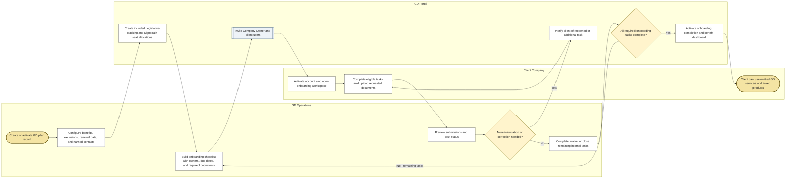

### J12 - GD Legal Request, Triage, and Matter Conversion

**Domain:** GD Portal  
**Primary actors:** GD Client User; GD Operations Admin; assigned GD Attorney; Centerbase  
**Trigger:** Client submits an employment-law request through the GD portal  
**Outcome:** Request is answered, scheduled, converted to matter-level work, or closed with full permission and audit controls  
**Integrations:** File storage; Calendly; Centerbase; email notifications  
**Traceability:** GD-REQ-01-09; GD-COMM-01-04; GD-MAT-01-04; GD-SCH-01-03; GD-AUD-01

**Scope notes:** Restricted requests are not automatically visible to Company Owners or Company HR Admins. Complete matters, work product, time entries, and billing remain in Centerbase.

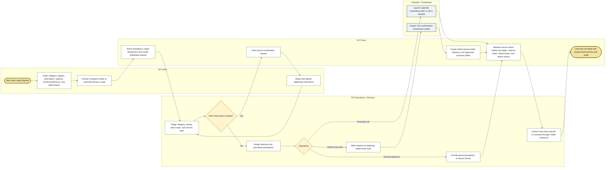

### J13 - GD Flat-Fee Project Request and Adobe Sign Handoff

**Domain:** GD Portal  
**Primary actors:** GD client; GD Operations Admin; GD Attorney; Adobe Sign; Centerbase  
**Trigger:** Client requests a handbook, policy, agreement, audit, or another configured flat-fee project  
**Outcome:** Proposal is accepted and converted to project / matter work, or declined and closed  
**Integrations:** Adobe Sign; Centerbase; email notifications  
**Traceability:** GD-PROJ-01-04; GD-MAT-01-04; Adobe Sign integration map

**Scope notes:** Pricing and scope may remain manual while the portal tracks lifecycle status. Adobe Sign is authoritative for signature status.

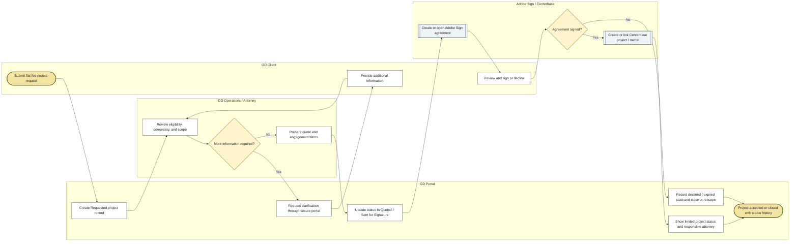

### J14 - GD-Included Signatrain HR Seat Provisioning

**Domain:** Cross-product GD to Signatrain  
**Primary actors:** GD Operations Admin; Company Owner / Company HR Admin; platform; invited HR user  
**Trigger:** A GD Concierge or All Access plan becomes active or changes  
**Outcome:** Included HR seat is assigned without a user Stripe transaction and Signatrain access becomes available  
**Integrations:** Shared entitlement layer; email provider  
**Traceability:** CORE-ENT-08; GD-XP-01/02; GD-PLAN-05; CORE-IAM-08; CORE-ENT-06

**Scope notes:** The entitlement source is GD_INCLUDED. No Stripe transaction is required for the recipient user.

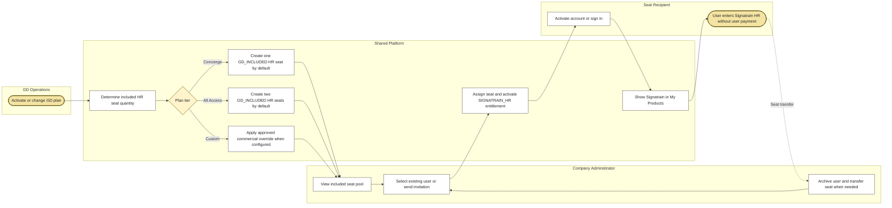

### J15 - Legislative Alert Authoring, Legal Review, and Distribution

**Domain:** Legislative Tracking MVP-Lite  
**Primary actors:** Alert editor; GD Attorney / legal reviewer; operations publisher; eligible recipient; platform  
**Trigger:** An employment-law change is identified through the manual monitoring process  
**Outcome:** Attorney-approved alert reaches only entitled organizations and jurisdictions, with read and audit records  
**Integrations:** Email provider; GD and Signatrain portal contexts  
**Traceability:** LT-AUTH-01-04; LT-REV-01-04; LT-DIST-01-04; LT-ACC-01-04; LT-REP-01; LT-AUD-01

**Scope notes:** Automated crawling, AI monitoring, and automated legal summaries are outside this module. Manager-only subscribers are excluded from Legislative Tracking.

```mermaid
%% J15 - Legislative Alert Authoring, Legal Review, and Distribution
%% Domain: Legislative Tracking MVP-Lite
%% Source requirements: LT-AUTH-01-04; LT-REV-01-04; LT-DIST-01-04; LT-ACC-01-04; LT-REP-01; LT-AUD-01
flowchart LR
  subgraph EDITOR["Alert Editor"]
    direction TB
    E1(["Create Draft alert"])
    E2["Enter summary, impact, action, topic, jurisdiction, source, and dates"]
    E3["Submit for legal review and assign reviewer"]
    E4["Configure audience, entitlement, organization coverage, and jurisdiction targeting"]
    E5["Review company delivery and read summary"]
  end
  subgraph LEGAL["GD Attorney / Legal Reviewer"]
    direction TB
    L1["Review legal accuracy and external wording"]
    D1{"Approve and sign off?"}
    L2["Return comments to Draft"]
  end
  subgraph PLAT["Legislative Tracking Service"]
    direction TB
    P1["Record approval and lock final sign-off metadata"]
    P2["Publish approved alert"]
    P3["Calculate eligible GD and Signatrain HR recipients"]
    P4[["Create in-app notification and limited-metadata email"]]
    P5["Record user read / unread state and delivery analytics"]
    P6["Archive alert on action or configured date"]
    END(["Authoring, sign-off, targeting, delivery, and archive remain audited"])
  end
  subgraph RECIP["Eligible Recipient"]
    direction TB
    R1["Open secure alert detail"]
    R2["Read summary, impact, recommended action, and attorney sign-off"]
  end
  E1 --> E2
  E2 --> E3
  E3 --> L1
  L1 --> D1
  D1 -->|"No"| L2
  L2 -->|"Revise"| E1
  D1 -->|"Yes"| P1
  P1 --> E4
  E4 --> P2
  P2 --> P3
  P3 --> P4
  P4 --> R1
  R1 --> R2
  R2 --> P5
  P5 --> E5
  E5 -->|"When no longer current"| P6
  P6 --> END
  classDef action fill:#FFFFFF,stroke:#3A3A3A,stroke-width:1px,color:#222222;
  classDef startend fill:#F4E4A3,stroke:#5A4A00,stroke-width:1.5px,color:#222222;
  classDef decision fill:#FFF4CC,stroke:#7A6500,stroke-width:1.5px,color:#222222;
  classDef integration fill:#EEF3F8,stroke:#3A5872,stroke-width:1px,color:#222222;
  classDef note fill:#F3F3F3,stroke:#777777,stroke-dasharray: 4 3,color:#333333;
  class E1,END startend;
  class E2,E3,L1,L2,P1,E4,P2,P3,R1,R2,P5,E5,P6 action;
  class D1 decision;
  class P4 integration;
```

### J16 - Legislative Tracking Jurisdiction Coverage Change

**Domain:** Legislative Tracking MVP-Lite  
**Primary actors:** Company Owner / Company HR Admin; internal operations; platform  
**Trigger:** Company requests a state or city coverage addition or removal  
**Outcome:** Approved coverage becomes effective for future alert targeting; rejected requests retain current coverage  
**Integrations:** Notifications; optional commercial / contract reference  
**Traceability:** LT-COV-01-03; CORE-ORG-06; LT-DIST-01

**Scope notes:** Coverage changes may require contract approval and commercial adjustment. Read status is not treated as legal acknowledgment.

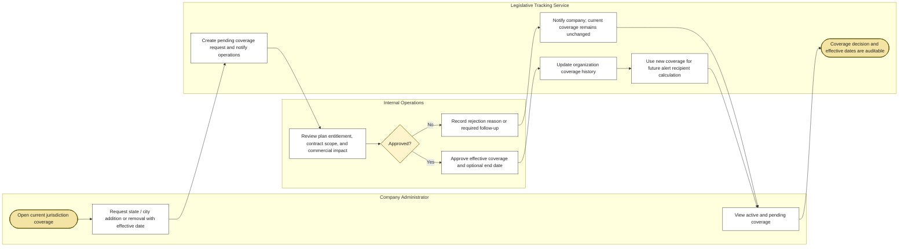
